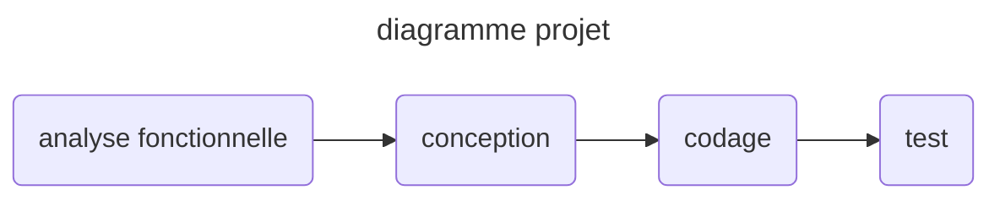

# cycle de vie du logiciel #

## Description ## 

### Implementation ###

- codage
- test
- intégration
- analyse fonctionnelle
- conception

 

```mermaid 
---
title: diagramme projet
---
flowchart LR
    A(analyse fonctionnelle)
    B(conception)
    C(codage)
    D(test)
    
    A --> B
    B --> C
    C --> D

```