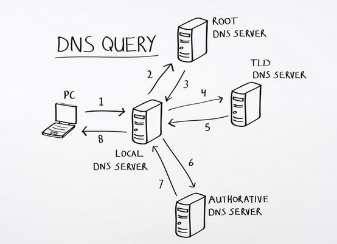

<link rel="stylesheet" href="./style.css"/>

# Wireshark lab

## HTTP 

## DNS #

4 types de serveurs DNS
- authoritative name servers 
- top level domain servers (resposable d'un seul domaine .com .fr ..)
- root servers (connait tous les domaines)
- local dns server

DNS records
- type A (resolve IPv4 adresse)
- type AAAA (resolve IPv6 adresse)
- type CNAME (resolve alias domain)
- type NS (donne le nom du authoritative name servers)
- type PTR (reverse DNS lookup)
  
## TCP 
