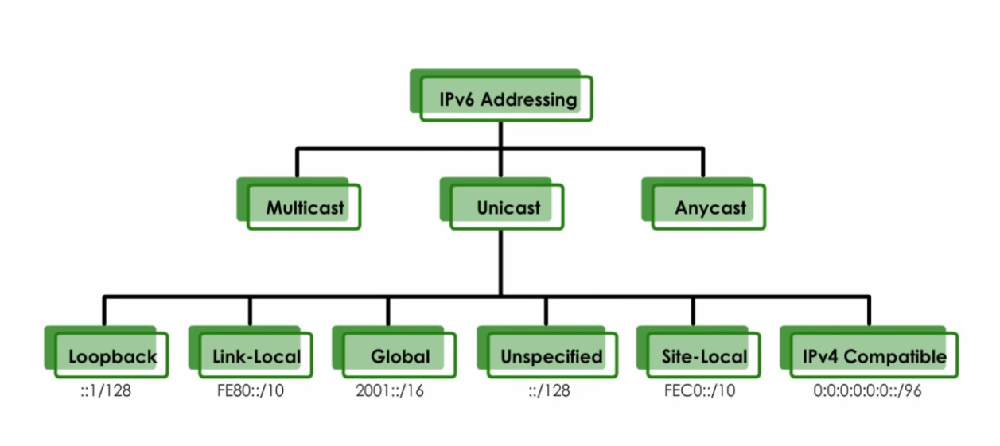
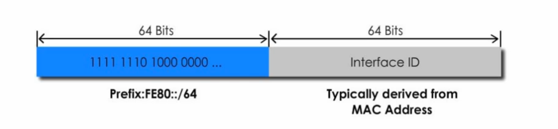
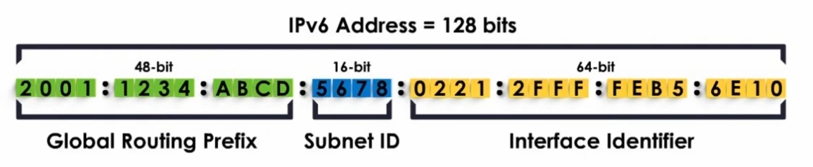
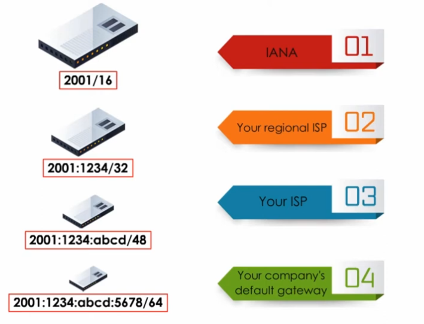
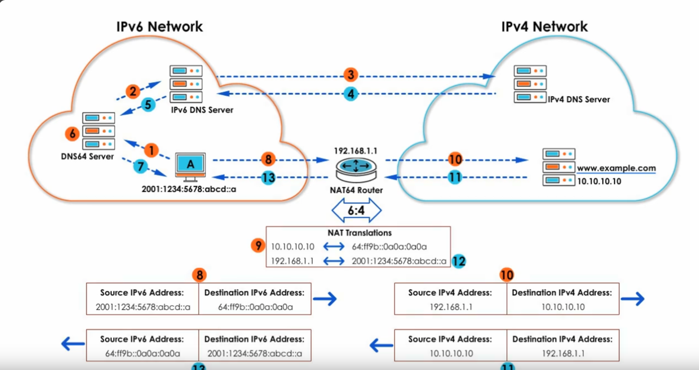

<link rel="stylesheet" href="./style.css" ></link>

# Types d'adresses IPV4 #

## <u>adresse unicast</u>  ##

1) **loopback** ::1/128 || 127.0.0.0/8
2) **link local**  FE80::/10 || 169.254.0.0/16 (APIPA pas de dhcp, reseau local, pas routable )
3) **global** 2001::/16 || public IP (routable sur internet)
4) **unspecified** ::/128 || 0.0.0.0 (*)
5) **site-local**  FEC0::/10 || private adresse (replace with unique local address (ULA))
6) **ULA** FC00::/7 || private LAN (routable en local)
7) **IPV4 compatible** 0:0:0:0:0:0::/96 

## <u>adresse multicast</u> ##   

1.**sollicited node** FF02::** (pour contacter de groupes de machine)

### <u>Link local:</u> ###
&nbsp;

adresse link local generee par le PC au moment ou il entre sur le reseau  
**E**xtended **U**nique **I**dentifier, c'est le systeme qui convertit les 48 bits de la mac adresse en 64 bits. (ajoute FFFE au milieu).   

### <u>global (public):</u> ### 
toutes les adresses publiques commencent par 2001 (/16 ouvert par IANA) 

&nbsp;

composition des 64 premiers bits

&nbsp;

les 64 suivants sont generes par EUI 64;
global routing prefix et subnet id viennent de la passerelle

<u>**N**eighbour **D**iscovery **P**rotocol:</u>

1. Router solicitation
2. Router advertisement
3. neighboor solicitation
4. neighboor advertisement
5. Redirection

StateLess Address Autoconfiguration (SLAAC systeme par defautt):  
- la machine se donne elle meme une adresse IPV6

Statefull Address Autoconfiguration (SFAAC):
- Avec serveur DPCP.

IPV6 adresse commence par 2002 = tunnel 6to4

<u>NAT 64</u>

