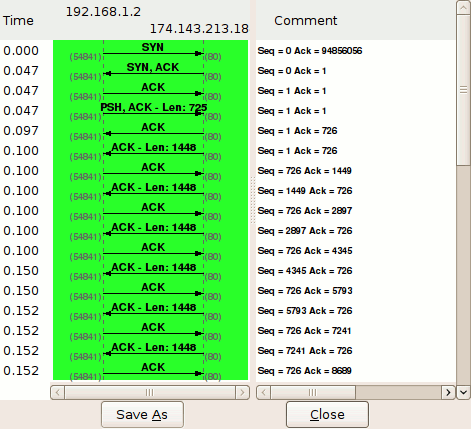
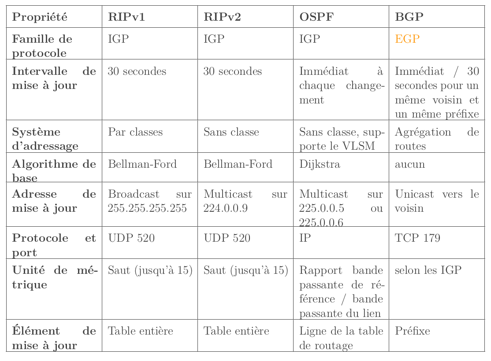

<link rel="stylesheet" href="./style.css"></link>

# LES RESEAUX

## Materiel: 

HUB:
- Renvoie a tous le monde
- topologie logique bus
- pas inteligent
- collisions (CSMA - CD)

SWITCH:
- renvoie a une seule machine
- mac adresse
- table cam
- pas de colisions

**topologie physique != topologie logique**

token ring => les machines se passent un jeton pour parler 

 

Structure d'un paquet reseau

 
 

# OSI et TCP/IP #

 

## Couche transport (TCP)

TCP header

 

TCP connection schema

 

TCP connection process (wireshark)

### <u>SEQ , ACK & WIN</u>

Le numero de sequence et le numero d'acquitement suivent les paquets et garantissent que rien ne se perd. 
Ils sont incrementes par le nombre de bytes envoyes 
Les flags SYN et ACK envoie un byte.

  

## Couche reseau

**IGP** : Intern Gateway Protocol 
**EGP** : Extern Gateway Protocol

Protocole de routage

